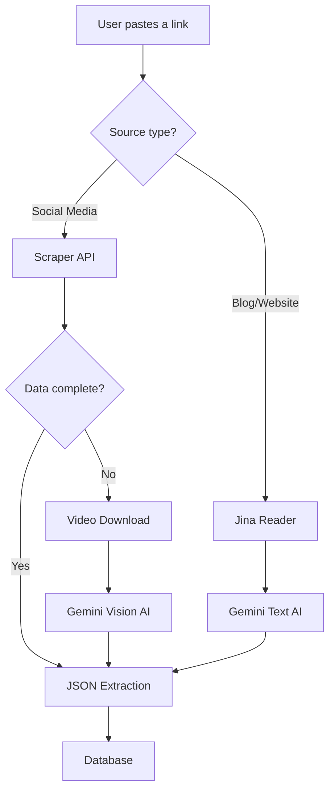

# 👨‍🍳 RecipeMe - Intelligent Recipe Manager

> Transform any TikTok, Instagram link or photo into a structured recipe using AI.

[](https://nextjs.org/)
[](https://www.typescriptlang.org/)


<!-- TODO: Add an animated GIF showing the complete flow (optional but recommended) -->
<!--  -->

### 💡 The Genesis of the Project

**RecipeMe** was born from a personal need: the frustration with recipe blogs saturated with ads and "quick" videos (TikTok/Reels) that don't list ingredients.

This project is an **experimental playground (R&D)** designed to explore the **Next.js 16** ecosystem and **Multimodal AI** capabilities. The goal was to create a tool capable of structuring chaos: transforming any visual content or URL into a clean and usable recipe card.

**Main technical challenge**: How to extract a precise recipe from a TikTok/Reels video where ingredients are never explicitly written? → **The Solution**: Implementation of frame-by-frame video analysis via **Gemini Vision**. If classic web scraping fails, the application intelligently switches to visual analysis to "watch" the video and deduce steps and quantities, just like a human would.

## ✨ Key Features

### 👨‍🍳 Recipe Module
*   **Smart Import** : Paste a link (Marmiton, Blog, Instagram, TikTok) or upload one/multiple screenshot(s).
*   **Advanced Scraping** : Optimized integration with recipe-scraper-api to extract social media content (Playwright + Stealth).
*   **Automatic Video Analysis** : Intelligent fallback to video analysis if web scraping doesn't provide enough information (TikTok/Instagram Reels support).
*   **Gemini AI** : Automatic extraction of ingredients, steps, time, tags and metadata.
*   **Performance Optimization** : Direct use of structured data from the scraper API (no double Gemini processing for social media).
*   **Cook Mode** : Wake Lock API to keep the screen on during preparation.
*   **Complete Management** : Manual editing, personal notes, tags, statuses (processing/completed/error).
*   **Source Link** : Button to quickly access the recipe source URL from the detail page.
*   **Automatic Retry** : Ability to retry processing in case of error.
*   **Automatic Cleanup** : Removal of recipes stuck in "processing" for more than 5 minutes.

---

## 🧠 Technical Challenges Solved

### 1. Extraction from videos without text
**Problem**: TikTok/Instagram Reels videos often don't have visible text or structured descriptions.

**Solution**: 
- Intelligent web scraping with Playwright + anti-detection techniques to extract metadata
- Automatic fallback to frame-by-frame video analysis with Gemini Vision if scraping fails
- Cost optimization: direct use of structured data from the scraper API (no double Gemini processing)

### 2. Asynchronous AI processing management
**Problem**: Gemini API calls can take several seconds, blocking the user interface.

**Solution**:
- Background processing with real-time status updates
- Client-side polling to detect status changes
- Error handling with automatic retry and cleanup of stuck recipes

### 3. Multi-source support with fallback
**Problem**: Each source (TikTok, Instagram, blog, screenshot) requires a different approach.

**Solution**: Modular architecture with automatic source type detection and intelligent routing.



- Multi-image support for screenshots (combining multiple images)

### 4. AI performance and costs
**Problem**: Gemini Vision API calls are expensive in tokens and time.

**Solution**:
- Intelligent ingredient parsing with regex to extract quantity/unit/name
- Usage metrics monitoring (tokens, costs) for optimization

---

## 🏗️ Architecture & Technical

### Technical Stack
*   **Framework** : Next.js 16+ (App Router, Server Actions, Server Components)
*   **Language** : Strict TypeScript
*   **AI** : Google Gemini 2.5 Flash (Multimodal Vision + Text)
*   **Scraping** : 
    *   [recipe-scraper-api](https://github.com/Tormknd/recipe-scraper-api) (External API for social media - Playwright + Stealth)
    *   Jina Reader (fallback for classic URLs)
*   **Database** : SQLite (via Prisma ORM)
*   **Styling** : Tailwind CSS v4 (latest) + Shadcn/UI
    *   Choice motivated by improved performance and the new CSS-native architecture of Tailwind v4
*   **Validation** : Zod for schema validation
*   **Browser APIs** : Wake Lock API (cook mode)
*   **PWA** : Manifest.json for mobile installation

### Project Structure
```
recipeme/
├── app/
│   ├── actions/              # Server Actions
│   │   ├── auth.ts           # Authentication
│   │   └── recipes.ts        # Recipe CRUD + ingestion
│   ├── login/                # Authentication page
│   ├── recipes/              # Recipe module
│   └── page.tsx              # Redirect to /recipes
├── components/
│   ├── features/             # Business components
│   │   ├── RecipeList.tsx
│   │   ├── EditRecipeForm.tsx
│   │   ├── CookModeToggle.tsx
│   │   └── ...
│   ├── ui/                   # UI components (Shadcn)
│   └── MainNav.tsx           # Main navigation
├── lib/
│   ├── recipes/
│   │   ├── ai-service.ts     # Gemini client + scrapers
│   │   └── schemas.ts         # Zod recipe validation
│   ├── prisma.ts             # Prisma client
│   └── utils.ts              # Utilities
├── prisma/
│   ├── schema.prisma         # Prisma schema
│   └── migrations/           # DB migrations
└── middleware.ts             # Route protection
```

### Data Models (Prisma)
*   **Recipe** : Recipes with structured JSON data

---

## 🚀 Installation & Development

### Prerequisites
1.  **Node.js 20+**
2.  **Gemini API Key** : Get a free key on [Google AI Studio](https://aistudio.google.com/).
3.  **recipe-scraper-api** (optional) : External API for social media scraping. If unavailable, automatic fallback to Jina Reader.

### Run locally
1.  **Copy envs** : Create a `.env` file at the root:
    ```env
    DATABASE_URL="file:./dev.db"
    GEMINI_API_KEY="AIzaSy..."     # Your Google API key (required)
    RECIPE_SCRAPER_URL="http://localhost:5000"  # recipe-scraper-api URL (optional)
    ```
2.  **Install** : `npm install`
3.  **DB Setup** : 
    ```bash
    npx prisma generate
    npx prisma migrate dev --name init
    ```
4.  **Dev** : `npm run dev`
    *   Access: `http://localhost:3000`

### Available Scripts
```bash
npm run dev      # Start development server
npm run build    # Production build
npm run start    # Start production server
npm run lint     # ESLint verification
```

### Useful Prisma Commands
```bash
npx prisma generate              # Generate Prisma client
npx prisma migrate dev           # Create and apply a migration
npx prisma migrate deploy        # Apply migrations in production
npx prisma studio                # Graphical interface for DB (dev)
```

### 💡 Recipe Ingestion

RecipeMe supports several methods to import recipes:

**Method 1: Via recipe-scraper-api (recommended for social media)**
1.  Configure `RECIPE_SCRAPER_URL` in your `.env` pointing to your recipe-scraper-api instance.
2.  Paste the Instagram/TikTok/Facebook link directly into RecipeMe.
3.  The API will use Playwright with anti-detection techniques to extract content.
4.  **Intelligent fallback**: If web scraping doesn't provide enough information, the API automatically switches to video analysis (download and analysis via Gemini Vision).
5.  **Optimization**: Structured data from the API is used directly without Gemini reprocessing, reducing costs and improving performance.

**Method 2: Classic URLs (blogs, recipe sites)**
1.  Paste the recipe URL (Marmiton, culinary blog, etc.).
2.  RecipeMe will use Jina Reader to extract content, then Gemini to structure the data.

**Method 3: Screenshot(s) (universal fallback)**
1.  Take one or more **screenshot(s)** of the recipe (ingredients/description/steps).
2.  In RecipeMe, go to **Recipes > Add > Screenshot**.
3.  The AI will analyze the image (Gemini Vision) and extract all information.
4.  Multi-image support: you can upload multiple screenshots for a complete recipe.

**Cook Mode**: On a recipe detail page, activate "Cook Mode" to keep the screen on during preparation (requires a browser supporting the Wake Lock API).

**Note**: 
*   If `RECIPE_SCRAPER_URL` is not configured or if the API is unavailable, RecipeMe will automatically fallback to Jina Reader or direct Gemini analysis.
*   The scraper API supports two methods: `web_scraping` (default) and `video_ai` (automatic fallback if data is incomplete).
*   Usage metrics (tokens, costs) are logged for monitoring.

---

## 🔧 Advanced Features

### Security & Performance
*   **Protection middleware** : Server-side session verification
*   **Server Actions** : Business logic executed server-side only
*   **Automatic revalidation** : Next.js cache updates after modifications
*   **Automatic cleanup** : Removal of recipes stuck in "processing"

### PWA & Mobile
*   **Manifest.json** : Configuration for mobile app installation
*   **Optimized viewport** : Mobile configuration with `viewport-fit: cover`
*   **Adaptive navigation** : Fixed navigation bar at the bottom on mobile
*   **Wake Lock API** : Cook mode to keep the screen on

## 📸 Screenshots

### Recipe list


### Login page


### Add recipe


### Recipe detail


### Recipe detail (alternative view)


---

## 📄 License

MIT

---

## 🌐 Language

This README is in English. A French version is available: [`README.md`](./README.md)

