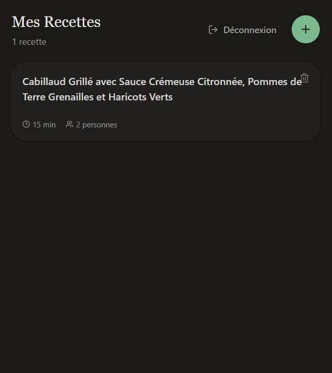
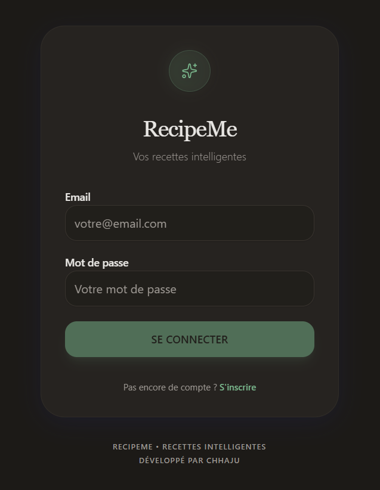
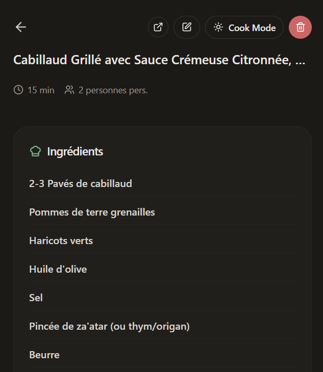
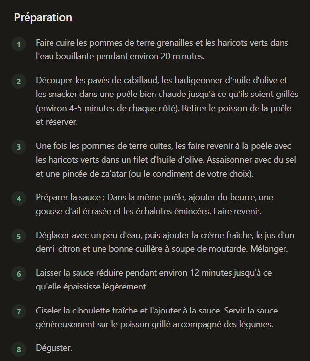

# 👨‍🍳 RecipeMe - Gestionnaire de Recettes Intelligent

> Transformez n'importe quel lien TikTok, Instagram ou photo en une recette structurée grâce à l'IA.

[](https://nextjs.org/)
[](https://www.typescriptlang.org/)



<!-- TODO: Ajouter un GIF animé montrant le flux complet (optionnel mais recommandé) -->
<!--  -->

### 💡 La genèse du projet

**RecipeMe** est né d'un besoin personnel : la frustration face aux blogs de cuisine saturés de publicités et aux vidéos "rapides" (TikTok/Reels) qui ne listent pas les ingrédients.

Ce projet est un **terrain d'expérimentation (R&D)** conçu pour explorer l'écosystème **Next.js 16** et les capacités de l'**IA Multimodale**. L'objectif était de créer un outil capable de structurer le chaos : transformer n'importe quel contenu visuel ou URL en une fiche recette propre et exploitable.

**Le défi technique principal** : Comment extraire une recette précise d'une vidéo TikTok/Reels où les ingrédients ne sont jamais écrits explicitement ? → **La Solution** : Implémentation d'une analyse vidéo frame-by-frame via **Gemini Vision**. Si le scraping web classique échoue, l'application bascule intelligemment vers l'analyse visuelle pour "regarder" la vidéo et en déduire les étapes et quantités, comme le ferait un humain.

## ✨ Fonctionnalités Clés

### 👨‍🍳 Module Recettes
*   **Import Intelligent** : Collez un lien (Marmiton, Blog, Instagram, TikTok) ou uploadez une/plusieurs capture(s) d'écran.
*   **Scraping Avancé** : Intégration optimisée avec recipe-scraper-api pour extraire le contenu des réseaux sociaux (Playwright + Stealth).
*   **Analyse Vidéo Automatique** : Fallback intelligent vers l'analyse vidéo si le scraping web ne fournit pas assez d'informations (support TikTok/Instagram Reels).
*   **Gemini AI** : Extraction automatique des ingrédients, étapes, temps, tags et métadonnées.
*   **Optimisation Performance** : Utilisation directe des données structurées de l'API scraper (pas de double traitement Gemini pour les réseaux sociaux).
*   **Mode Cuisson** : Wake Lock API pour maintenir l'écran allumé pendant la préparation.
*   **Gestion complète** : Édition manuelle, notes personnelles, tags, statuts (processing/completed/error).
*   **Lien source** : Bouton pour accéder rapidement à l'URL source de la recette depuis la page de détail.
*   **Retry automatique** : Possibilité de relancer le traitement en cas d'erreur.
*   **Nettoyage automatique** : Suppression des recettes bloquées en "processing" depuis plus de 5 minutes.

---

## 🧠 Challenges Techniques Résolus

### 1. Extraction depuis des vidéos sans texte
**Problème** : Les vidéos TikTok/Instagram Reels n'ont souvent pas de texte visible ou de description structurée.

**Solution** : 
- Scraping web intelligent avec Playwright + techniques anti-détection pour extraire les métadonnées
- Fallback automatique vers l'analyse vidéo frame-by-frame avec Gemini Vision si le scraping échoue
- Optimisation des coûts : utilisation directe des données structurées de l'API scraper (pas de double traitement Gemini)

### 2. Gestion asynchrone du traitement IA
**Problème** : Les appels Gemini peuvent prendre plusieurs secondes, bloquant l'interface utilisateur.

**Solution** :
- Traitement en arrière-plan avec mise à jour du statut en temps réel
- Polling côté client pour détecter les changements de statut
- Gestion des erreurs avec retry automatique et nettoyage des recettes bloquées

### 3. Support multi-sources avec fallback
**Problème** : Chaque source (TikTok, Instagram, blog, capture d'écran) nécessite une approche différente.

**Solution** :
- Architecture modulaire avec fallback en cascade : Scraper API → Jina Reader → Gemini direct
- Détection automatique du type de source et routage vers le bon traitement
- Support multi-images pour les captures d'écran (combinaison de plusieurs images)

### 4. Performance et coûts IA
**Problème** : Les appels Gemini Vision sont coûteux en tokens et en temps.

**Solution** :
- Utilisation directe des données structurées de l'API scraper (évite le retraitement)
- Parsing intelligent des ingrédients avec regex pour extraire quantité/unité/nom
- Monitoring des métriques d'utilisation (tokens, coûts) pour optimisation

---

## 🏗️ Architecture & Technique

### Stack Technique
*   **Framework** : Next.js 16+ (App Router, Server Actions, Server Components)
*   **Langage** : TypeScript strict
*   **IA** : Google Gemini 2.5 Flash (Multimodal Vision + Texte)
*   **Scraping** : 
    *   [recipe-scraper-api](https://github.com/Tormknd/recipe-scraper-api) (API externe pour réseaux sociaux - Playwright + Stealth)
    *   Jina Reader (fallback pour URLs classiques)
*   **Base de Données** : SQLite (via Prisma ORM)
*   **Style** : Tailwind CSS v4 (latest) + Shadcn/UI
    *   Choix motivé par les performances améliorées et la nouvelle architecture CSS-native de Tailwind v4
*   **Validation** : Zod pour la validation des schémas
*   **APIs Browser** : Wake Lock API (mode cuisson)
*   **PWA** : Manifest.json pour installation mobile

### Structure du Projet
```
recipeme/
├── app/
│   ├── actions/              # Server Actions
│   │   ├── auth.ts           # Authentification
│   │   └── recipes.ts        # CRUD recettes + ingestion
│   ├── login/                # Page authentification
│   ├── recipes/              # Module recettes
│   └── page.tsx              # Redirection vers /recipes
├── components/
│   ├── features/             # Composants métier
│   │   ├── RecipeList.tsx
│   │   ├── EditRecipeForm.tsx
│   │   ├── CookModeToggle.tsx
│   │   └── ...
│   ├── ui/                   # Composants UI (Shadcn)
│   └── MainNav.tsx           # Navigation principale
├── lib/
│   ├── recipes/
│   │   ├── ai-service.ts     # Client Gemini + scrapers
│   │   └── schemas.ts        # Validation Zod recettes
│   ├── prisma.ts             # Client Prisma
│   └── utils.ts              # Utilitaires
├── prisma/
│   ├── schema.prisma         # Schéma Prisma
│   └── migrations/           # Migrations DB
└── middleware.ts             # Protection routes
```

### Modèles de Données (Prisma)
*   **Recipe** : Recettes avec données structurées JSON

---

## 🚀 Installation & Développement

### Pré-requis
1.  **Node.js 20+**
2.  **Clé API Gemini** : Obtenez une clé gratuite sur [Google AI Studio](https://aistudio.google.com/).
3.  **recipe-scraper-api** (optionnel) : API externe pour le scraping des réseaux sociaux. Si non disponible, fallback automatique vers Jina Reader.

### Lancer en local
1.  **Copier les envs** : Créer un fichier `.env` à la racine :
    ```env
    DATABASE_URL="file:./dev.db"
    GEMINI_API_KEY="AIzaSy..."     # Votre clé API Google (obligatoire)
    RECIPE_SCRAPER_URL="http://localhost:5000"  # URL de l'API recipe-scraper-api (optionnel)
    ```
2.  **Install** : `npm install`
3.  **DB Setup** : 
    ```bash
    npx prisma generate
    npx prisma migrate dev --name init
    ```
4.  **Dev** : `npm run dev`
    *   Accès : `http://localhost:3000`

### Scripts Disponibles
```bash
npm run dev      # Démarre le serveur de développement
npm run build    # Build de production
npm run start    # Démarre le serveur de production
npm run lint     # Vérification ESLint
```

### Commandes Prisma Utiles
```bash
npx prisma generate              # Génère le client Prisma
npx prisma migrate dev           # Crée et applique une migration
npx prisma migrate deploy        # Applique les migrations en production
npx prisma studio                # Interface graphique pour la DB (dev)
```

### 💡 Ingestion de Recettes

RecipeMe supporte plusieurs méthodes pour importer des recettes :

**Méthode 1 : Via recipe-scraper-api (recommandé pour réseaux sociaux)**
1.  Configurez `RECIPE_SCRAPER_URL` dans votre `.env` pointant vers votre instance de recipe-scraper-api.
2.  Collez directement le lien Instagram/TikTok/Facebook dans RecipeMe.
3.  L'API utilisera Playwright avec techniques anti-détection pour extraire le contenu.
4.  **Fallback intelligent** : Si le scraping web ne fournit pas assez d'informations, l'API bascule automatiquement vers l'analyse vidéo (téléchargement et analyse via Gemini Vision).
5.  **Optimisation** : Les données structurées de l'API sont utilisées directement sans retraitement Gemini, réduisant les coûts et améliorant les performances.

**Méthode 2 : URLs classiques (blogs, sites de recettes)**
1.  Collez l'URL de la recette (Marmiton, blog culinaire, etc.).
2.  RecipeMe utilisera Jina Reader pour extraire le contenu, puis Gemini pour structurer les données.

**Méthode 3 : Capture(s) d'écran (fallback universel)**
1.  Faites une ou plusieurs **capture(s) d'écran** de la recette (ingrédients/description/étapes).
2.  Dans RecipeMe, allez dans **Recettes > Ajouter > Capture**.
3.  L'IA analysera l'image (Vision Gemini) et extraira toutes les informations.
4.  Support multi-images : vous pouvez uploader plusieurs captures pour une recette complète.

**Mode Cuisson** : Sur la page de détail d'une recette, activez le "Cook Mode" pour maintenir l'écran allumé pendant la préparation (nécessite un navigateur supportant la Wake Lock API).

**Note** : 
*   Si `RECIPE_SCRAPER_URL` n'est pas configuré ou si l'API est indisponible, RecipeMe basculera automatiquement vers Jina Reader ou l'analyse directe par Gemini.
*   L'API scraper supporte deux méthodes : `web_scraping` (par défaut) et `video_ai` (fallback automatique si les données sont incomplètes).
*   Les métriques d'utilisation (tokens, coûts) sont loggées pour le monitoring.

---

## 🔧 Fonctionnalités Avancées

### Sécurité & Performance
*   **Middleware de protection** : Vérification des sessions côté serveur
*   **Server Actions** : Logique métier exécutée côté serveur uniquement
*   **Revalidation automatique** : Mise à jour des caches Next.js après modifications
*   **Nettoyage automatique** : Suppression des recettes bloquées en "processing"

### PWA & Mobile
*   **Manifest.json** : Configuration pour installation en application mobile
*   **Viewport optimisé** : Configuration pour mobile avec `viewport-fit: cover`
*   **Navigation adaptative** : Barre de navigation fixe en bas sur mobile
*   **Wake Lock API** : Mode cuisson pour maintenir l'écran allumé

## 📸 Captures d'écran

### Liste des recettes


### Page de connexion


### Ajout d'une recette


### Détail d'une recette


### Détail d'une recette (vue alternative)



---

## 📄 Licence

MIT

---

## 🌐 Langue

Ce README est en français. Une version anglaise est disponible : [`README.en.md`](./README.en.md)

> 💡 **Pour les recruteurs internationaux** : La version anglaise est disponible dans [`README.en.md`](./README.en.md).


